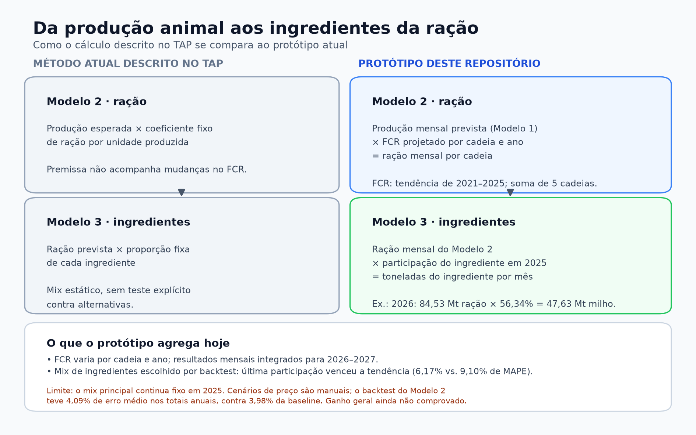
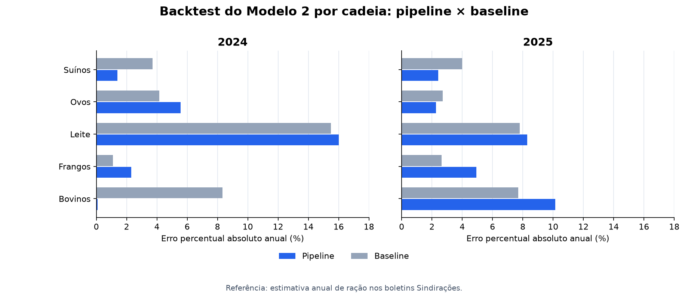
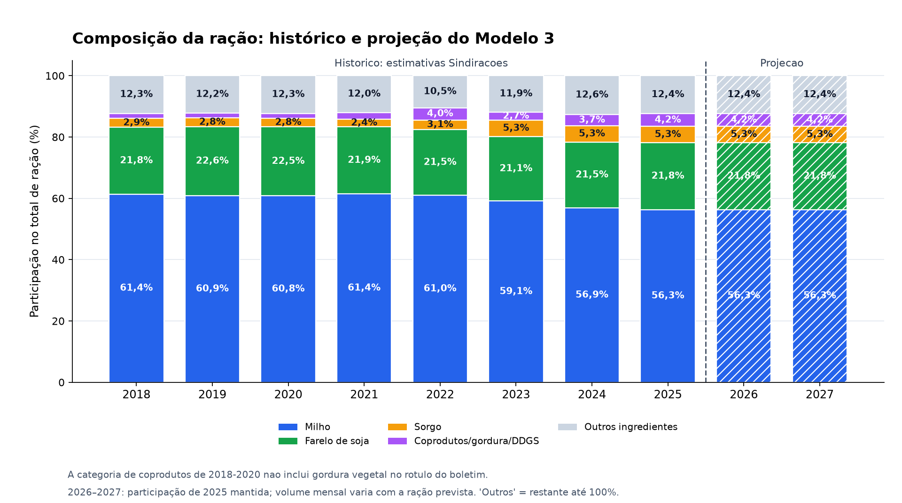

# Documentação dos modelos — anos completos de 2026 e 2027

**Objetivo:** prever janeiro de 2026 a dezembro de 2027 (24 meses, dois anos civis completos). As avaliações do Modelo 1 foram refeitas para janeiro de 2024 a dezembro de 2025, também dois anos completos. Os CSVs descritos abaixo foram recalculados para esse recorte.

| Etapa | Saída | Período |
|---|---|---|
| Modelo 1 | Produção mensal de bovinos, suínos, frangos, ovos e leite | jan/2026–dez/2027 |
| Modelo 2 | Demanda mensal e anual de ração das cinco cadeias | 2026 e 2027 completos |
| Modelo 3 | Demanda de milho, farelo de soja, sorgo e grupo de coprodutos/gordura vegetal/DDGS | 2026 e 2027 completos |

### Como os Modelos 2 e 3 fazem o cálculo

A coluna “método atual” resume a abordagem descrita no TAP, **não uma auditoria dos sistemas internos da LDC**. A imagem é reproduzida por [`gerar_diagrama_modelos_2_3.py`](notebooks/gerar_diagrama_modelos_2_3.py). O Modelo 2 projeta o FCR por cadeia e ano; no Modelo 3, a participação principal ainda é a de 2025. Portanto, o protótipo não comprova substituição dinâmica de ingredientes por preço.

**Leitura dos dados:** “observado” no Modelo 1 significa produção registrada pelo IBGE/SIDRA. Para o Modelo 3, a Sindirações classifica 2018–2025 como `estimativa` e 2026 como `previsao`. A previsão oficial de 2026 **não é consumo realizado**. Cada modelo tem alvo e unidade próprios; seus MAPEs não são diretamente comparáveis.

## Modelo 1 — produção animal

### Recorte e features

O backtest treina até **dez/2023** e prevê **jan/2024–dez/2025** recursivamente, sem usar observações desses dois anos como entrada nos meses seguintes. Depois, o candidato com menor MAPE em cada categoria é reajustado com dados até **dez/2025** e prevê **jan/2026–dez/2027**. As bases contêm produção até jun/2026, mas as observações de 2026 **não entram no ajuste**.

| Categorias | Treino do backtest | Avaliação | Reajuste final | Previsão final |
|---|---|---|---|---|
| Bovinos, suínos, frangos, ovos e leite | jan/2004–dez/2023, 235 linhas válidas | jan/2024–dez/2025, 24 meses completos | jan/2004–dez/2025, 259 linhas válidas | jan/2026–dez/2027, 24 meses |

As séries de produção começam antes de 2004, mas a base com todas as features começa em jan/2004. Faltam fev–jun/2004; de jul/2004 em diante as linhas válidas são mensais contínuas. O código exige todos os 12 meses de cada ano avaliado.

Os **alvos** são peso total das carcaças (bovinos, suínos e frangos; kg), produção de ovos (mil dúzias) e leite adquirido (mil litros). Regressão linear e Random Forest com 300 árvores usam as mesmas **features**: mês como seno/cosseno; valores anteriores do próprio alvo com defasagens de 1, 2, 3 e 12 meses; médias anteriores de 3 e 12 meses; preços de milho, soja paranaense e sorgo estimado. Outras colunas das bases, como animais abatidos, não são usadas. Os preços futuros são mantidos no último valor do treino: dez/2023 no backtest e dez/2025 na previsão final.

### Baseline e erros

A **baseline sazonal** repete em cada mês de 2024 **e** 2025 o valor do mesmo mês de 2023. Como os candidatos, ela não recebe observações dos meses avaliados. O MAPE é a média do erro percentual absoluto dos **24 meses**; o RMSE está em **milhões da unidade indicada**. A baseline serve para comparação; a escolha da previsão final considera regressão linear e Random Forest.

| Categoria / unidade do RMSE | Candidato | MAPE | RMSE | Escolhido |
|---|---|---:|---:|---|
| Bovinos / milhões kg | Regressão linear | 15,74% | 162,48 | |
| | Random Forest | **9,63%** | **109,90** | Sim |
| | Baseline sazonal | 16,40% | 159,17 | |
| Suínos / milhões kg | Regressão linear | **4,14%** | **23,22** | Sim |
| | Random Forest | 5,49% | 30,83 | |
| | Baseline sazonal | 5,99% | 33,97 | |
| Frangos / milhões kg | Regressão linear | 4,93% | 74,92 | |
| | Random Forest | **4,58%** | **72,29** | Sim |
| | Baseline sazonal | 6,61% | 95,72 | |
| Ovos / milhões de dúzias | Regressão linear | **5,83%** | **25,56** | Sim |
| | Random Forest | 11,10% | 47,65 | |
| | Baseline sazonal | 11,73% | 49,40 | |
| Leite / milhões de litros | Regressão linear | 6,93% | 199,50 | |
| | Random Forest | **6,42%** | **177,27** | Sim |
| | Baseline sazonal | 6,92% | 187,75 | |

O candidato escolhido supera a baseline em MAPE nas cinco categorias. Para leite, a vantagem é pequena: 6,42% contra 6,92%.

### Observado × previsto por ano civil

Somatórios de **janeiro a dezembro** no backtest. As unidades foram convertidas para milhões de kg, dúzias ou litros. “Diferença” é `(previsto / observado − 1) × 100` no **total anual**; ela não é o MAPE mensal da tabela anterior.

| Categoria / unidade | Ano | Observado | Previsto pelo escolhido | Diferença anual |
|---|---:|---:|---:|---:|
| Bovinos / milhões kg | 2024 | 10.355,9 | 9.615,0 | −7,15% |
| | 2025 | 11.103,2 | 9.679,0 | −12,83% |
| Suínos / milhões kg | 2024 | 5.358,9 | 5.493,7 | +2,52% |
| | 2025 | 5.656,4 | 5.720,3 | +1,13% |
| Frangos / milhões kg | 2024 | 13.714,7 | 13.435,7 | −2,03% |
| | 2025 | 14.304,3 | 13.445,1 | −6,01% |
| Ovos / milhões de dúzias | 2024 | 4.688,3 | 4.441,9 | −5,26% |
| | 2025 | 4.954,1 | 4.634,9 | −6,44% |
| Leite / milhões de litros | 2024 | 25.366,1 | 24.684,6 | −2,69% |
| | 2025 | 27.613,0 | 24.796,0 | −10,20% |

O arquivo [`modelo1_backtest_mensal.csv`](documentos/tratados/modelo1_backtest_mensal.csv) registra **cada mês observado e previsto** para os dois candidatos e a baseline. [`modelo1_previsao.csv`](documentos/tratados/modelo1_previsao.csv) traz jan/2026–dez/2027. Existem observações de jan–jun/2026 no repositório, mas **não há ano completo realizado de 2026 ou 2027** para calcular o erro anual da previsão final.

## Modelo 2 — demanda de ração

O FCR de cada cadeia é calculado em **2021–2025** como ração reportada pela Sindirações dividida pela produção anual do IBGE/SIDRA. Uma regressão linear usa **ano como única feature** para extrapolar o FCR de 2026 e 2027. A demanda prevista é **produção mensal prevista pelo Modelo 1 × FCR projetado** da categoria e do ano. O resultado agora contém os **12 meses previstos de 2026 e os 12 de 2027**, sem inserir os meses observados do início de 2026.

### Backtest anual do pipeline: 2024 e 2025

Foi executado um backtest **por ano de referência dos dados**, com dois anos fechados. Para prever 2024, a produção é treinada até 2023 e o FCR usa 2021–2023; para prever 2025, a produção é treinada até 2024 e o FCR usa 2021–2024. Em cada rodada, o candidato de produção (regressão linear ou Random Forest) é escolhido usando **somente o ano anterior ao ano avaliado**. A produção é prevista recursivamente por 12 meses, com preços mantidos no último valor do treino. A ração prevista é a produção prevista multiplicada pelo FCR projetado por tendência. A **baseline** repete a demanda de ração da mesma categoria no ano anterior. A referência são as quantidades anuais classificadas como `estimativa` nos boletins da Sindirações. Não há consumo **mensal** observado de ração nos arquivos, portanto o erro de ração só pode ser avaliado **anualmente**.

| Ano | Cinco cadeias: referência | Pipeline | Erro absoluto do pipeline | Baseline | Erro absoluto da baseline |
|---|---:|---:|---:|---:|---:|
| 2024 | 80,00 milhões t | 77,30 milhões t | 3,37% | 76,80 milhões t | 4,00% |
| 2025 | 83,30 milhões t | 79,29 milhões t | 4,81% | 80,00 milhões t | 3,96% |

No gráfico, barras menores indicam previsões mais próximas da referência anual da Sindirações.

| Agregação dos dois anos | Pipeline | Baseline | Leitura |
|---|---:|---:|---|
| MAPE das 10 comparações **categoria × ano** | **5,34%** | 5,76% | Pipeline ligeiramente melhor |
| RMSE das 10 comparações **categoria × ano** | 0,843 milhão t | **0,709 milhão t** | Baseline melhor; erros grandes pesam mais |
| MAPE dos **dois totais anuais** das cinco cadeias | 4,09% | **3,98%** | Baseline ligeiramente melhor |
| RMSE dos **dois totais anuais** | 3,414 milhões t | **3,250 milhões t** | Baseline melhor |

O maior erro individual do pipeline foi **leite em 2024: 16,00%**, contra 15,49% da baseline. Um diagnóstico que aplica o FCR projetado à **produção observada** do ano-alvo deu MAPE médio de 3,43%, contra 3,60% ao manter o último FCR. Esse diagnóstico isola o FCR, mas **não é uma previsão implantável**, pois usa produção do ano avaliado. O ganho pequeno no FCR não se traduz em ganho claro no total do pipeline. As dez linhas, as escolhas de modelo e os recortes estão em [`modelo2_backtest_categorias.csv`](documentos/tratados/modelo2_backtest_categorias.csv); os totais e métricas estão em [`modelo2_backtest_totais.csv`](documentos/tratados/modelo2_backtest_totais.csv) e [`modelo2_backtest_resumo.csv`](documentos/tratados/modelo2_backtest_resumo.csv). O cálculo é reproduzido por [`backtest_modelo2.py`](notebooks/backtest_modelo2.py).

**Limite temporal:** os boletins publicam estimativas de um ano depois que ele termina. Por exemplo, o valor de 2024 usado no FCR da rodada de 2025 está no boletim de maio de 2025. Assim, este backtest impede usar **valores do próprio ano-alvo no ajuste**, mas **não comprova** que todas as entradas estavam publicadas em 1º de janeiro do ano previsto. É uma avaliação retrospectiva por ano de referência, não uma simulação rigorosa de disponibilidade na data da previsão.

### Comparação da projeção de 2026 com a previsão oficial

A comparação abaixo usa a **previsão oficial de 2026** da Sindirações para as mesmas cinco cadeias. A diferença é **entre duas previsões**, não erro contra o real:

| Categoria | Modelo 2, milhões t | Sindirações 2026, milhões t | Diferença |
|---|---:|---:|---:|
| Bovinos de corte | 7,768 | 8,200 | −5,27% |
| Frangos | 37,749 | 39,100 | −3,45% |
| Bovinos de leite | 8,279 | 7,900 | +4,80% |
| Poedeiras/ovos | 7,510 | 7,700 | −2,47% |
| Suínos | 23,225 | 23,100 | +0,54% |
| **Cinco cadeias** | **84,531** | **86,000** | **−1,71%** |

O boletim prevê **93,659 milhões t para todas as cadeias** em 2026; esse total tem escopo maior e não é comparação direta. O Modelo 2 prevê **84,531 milhões t em 2026** e **85,184 milhões t em 2027**. O backtest histórico acima não fornece erro realizado para essas duas previsões futuras.

## Modelo 3 — macroingredientes

O Modelo 3 calcula a participação anual como **toneladas do ingrediente na coluna “TOTAL RAÇÕES” ÷ total de toneladas de ração da mesma coluna**. As referências são estimativas da Sindirações, sujeitas a revisão; não são medições auditadas de consumo. A série agora cobre **2018–2025** (oito anos). As novas estimativas vêm dos boletins oficiais de [julho/2019, para 2018](https://sindiracoes.org.br/wp-content/uploads/2019/07/boletim_informativo_do_setor_julho_2019_vs_final_port_sindiracoes.pdf), [junho/2020, para 2019](https://sindiracoes.org.br/wp-content/uploads/2020/06/boletim_informativo_do_setor_junho_2020_vs_final_port_sindiracoes_c.pdf) e [março/2021, para 2020](https://sindiracoes.org.br/wp-content/uploads/2021/03/boletim_informativo_do_setor_marco_2021_vs_final_port_sindiracoes.pdf). Os anos 2021–2025 continuam nos boletins já usados no projeto. A previsão oficial de 2026 é mantida fora do treino.

| Ano acrescentado | Milho (t) | Farelo de soja (t) | Sorgo (t) | Coprodutos (t) | Total ração (t) |
|---|---:|---:|---:|---:|---:|
| 2018 | 42.428.716 | 15.072.958 | 2.022.993 | 1.117.978 | 69.156.015 |
| 2019 | 45.213.996 | 16.756.978 | 2.073.758 | 1.164.305 | 74.294.151 |
| 2020 | 47.392.551 | 17.553.990 | 2.177.384 | 1.225.830 | 77.941.309 |

**Comparabilidade:** nos boletins de 2018–2020, o quarto grupo é chamado “coprodutos de arroz, soja, cana, polpa de laranja e DDGS”. A partir da fonte usada para 2021, o rótulo inclui também **gordura vegetal**. Não há desagregação para corrigir essa mudança. Por isso, o quarto grupo aparece nos resultados e no gráfico, mas a **escolha do método principal** usa somente milho, farelo de soja e sorgo. O quarto grupo não representa DDGS isolado.

### Participação na ração

A participação de 2025 continua nas projeções de 2026–2027. Isso ocorre porque a regra de manter a última participação venceu a tendência para os três grupos comparáveis; **com o método escolhido, acrescentar 2018–2020 aumenta a validação, mas não altera numericamente a previsão principal**. Os volumes mensais mudam conforme a demanda prevista pelo Modelo 2. “Outros ingredientes” completa 100%. O gráfico é reproduzido por [`gerar_grafico_participacao.py`](notebooks/gerar_grafico_participacao.py).

### Validação temporal

Para cada ano avaliado, as funções existentes comparam **última participação** e **reta linear da participação em função do ano**, treinadas apenas com estimativas de anos anteriores. A primeira avaliação possível com três anos de treino é 2021. As janelas são 2018–2020 → 2021, 2018–2021 → 2022, 2018–2022 → 2023, 2018–2023 → 2024 e 2018–2024 → 2025. Os erros abaixo são MAPE médio de milho, farelo de soja e sorgo; o [CSV de métricas](documentos/tratados/modelo3_metricas.csv) traz cada ingrediente, previsão e referência.

| Ano avaliado | Última participação | Tendência linear |
|---|---:|---:|
| 2021 | 6,23% | 5,96% |
| 2022 | 8,23% | 9,35% |
| 2023 | 15,45% | 17,68% |
| 2024 | 2,22% | 7,30% |
| 2025 | 1,19% | 2,23% |
| **Média 2021–2025** | **6,67%** | **8,50%** |

Para isolar o efeito de ampliar o treino, comparamos também **os mesmos alvos de 2024 e 2025**. A tabela completa está em [`modelo3_comparacao_janelas.csv`](documentos/tratados/modelo3_comparacao_janelas.csv).

| Treino disponível | Grupo avaliado | Última participação | Tendência linear |
|---|---|---:|---:|
| Desde 2021 | 3 ingredientes comparáveis | 1,71% | 9,83% |
| Desde 2018 | 3 ingredientes comparáveis | 1,71% | 4,77% |
| Desde 2021 | 4 grupos, incluindo coprodutos | 6,17% | 9,10% |
| Desde 2018 | 4 grupos, incluindo coprodutos | 6,17% | 4,54% |

A tendência melhora quando recebe mais anos, mas **não supera a última participação nos três ingredientes comparáveis**. A vantagem aparente da tendência nos quatro grupos em 2024–2025 é influenciada pelo grupo de coprodutos, cuja definição mudou. Na avaliação ampliada de 2021–2025, o MAPE desse grupo isolado foi **32,36%** para a última participação e **25,09%** para a tendência; esse resultado não basta para declarar ganho de previsão de DDGS.

Contra a **previsão oficial**, ainda não realizada, de 2026, a diferença percentual da participação principal é 0,08% para milho, 0,02% para farelo de soja, 0,22% para sorgo e 0,42% para coprodutos. Trata-se de comparação entre previsões, não de erro contra consumo observado.

A participação anual é aplicada aos 12 meses correspondentes do Modelo 2, sob a premissa de **mix constante dentro do ano**. Para 2026, são projetados 47,626 milhões t de milho, 18,396 milhões t de farelo de soja, 4,512 milhões t de sorgo e 3,514 milhões t de coprodutos; para 2027, respectivamente 47,995, 18,539, 4,547 e 3,541 milhões t. Não há volume observado mensal de ingredientes nem volume por cadeia nos arquivos usados, portanto não existe backtest integrado das toneladas de ingredientes. Os cenários de preço permanecem análise de sensibilidade com parâmetros fixados no código, sem erro retrospectivo medido. Na base de preços, o sorgo foi estimado como 85% do preço do milho, sem variação relativa independente; o preço de soja usado não é o do farelo. A função de limites ainda pode permitir soma acima de 100% se uma entrada já exceder 100%; isso precisa ser corrigido.

**Limite temporal:** a validação usa o ano a que cada estimativa se refere, não uma reconstrução rigorosa das informações disponíveis em 1º de janeiro daquele ano. Em particular, a estimativa de 2025 entrou no boletim de março/2026. Assim, esta previsão não representa uma emissão possível em 31/12/2025.

### Experimento: mix por cadeia animal

Também foi implementada uma alternativa **separada da previsão principal**. Para cada uma das cinco cadeias do Modelo 2 — frangos de corte, poedeiras/ovos, suínos, bovinos de leite e bovinos de corte —, o [script do experimento](notebooks/testar_mix_cadeias.py) extrai dos boletins as toneladas de ração e dos quatro grupos de ingredientes. O [histórico por cadeia](documentos/tratados/modelo3_mix_cadeias_historico.csv) cobre **2018–2025**; os valores de 2018–2020 foram transcritos dos PDFs oficiais citados acima, e 2021–2025 são extraídos dos PDFs locais e conferidos contra os totais nacionais. O grupo de coprodutos mantém a ressalva de definição já descrita.

Para prever o ano `t`, a alternativa mantém a participação de `t−1` **dentro de cada cadeia** e calcula `soma(ração prevista da cadeia em t × participação da cadeia em t−1) ÷ soma(ração prevista das cinco cadeias em t)`. A baseline de comparação mantém a participação agregada das **mesmas cinco cadeias** em `t−1`. Assim, previsto e referência têm exatamente o mesmo escopo; a baseline nacional apresentada acima é outro alvo e seu MAPE não deve ser comparado diretamente com este.

O [backtest detalhado](documentos/tratados/modelo3_mix_cadeias_backtest.csv) inclui 2019–2025 com pesos da ração do próprio ano, apenas para isolar o cálculo do mix. Para o teste integrado, usa os **pesos previstos pelo backtest do Modelo 2** em 2024 e 2025. A tabela mostra o MAPE médio dos três ingredientes comparáveis; o [resumo](documentos/tratados/modelo3_mix_cadeias_resumo.csv) também contém cada ano e o quarto grupo.

| Teste | Baseline das cinco cadeias | Mix por cadeia |
|---|---:|---:|
| Participação, 2024–2025, pesos previstos pelo Modelo 2 | **1,66%** | 1,86% |
| Toneladas, 2024–2025, pesos previstos pelo Modelo 2 | 4,18% | **4,10%** |
| Participação, 2019–2025, pesos da ração estimada para o próprio ano (diagnóstico) | **4,95%** | 5,78% |

**Conclusão:** a alternativa não supera a baseline em participação. A vantagem de **0,08 ponto percentual** no MAPE de toneladas do teste integrado é pequena, ocorre em apenas dois anos e inclui o erro do Modelo 2. Portanto, a previsão principal continua como está. As [projeções experimentais de 2026–2027](documentos/tratados/modelo3_mix_cadeias_previsao_anual.csv) mostram o que o método produziria para **somente as cinco cadeias**; não são totais nacionais. A série mensal experimental também está em [CSV](documentos/tratados/modelo3_mix_cadeias_previsao_mensal.csv). O teste ainda é por ano dos dados, não por data de publicação.

## Conclusões e ressalva sobre disponibilidade

1. No backtest recursivo de **2024 e 2025 completos**, o candidato escolhido do Modelo 1 supera a baseline sazonal nas cinco cadeias. Os maiores desvios nos **totais anuais de 2025** aparecem em bovinos e leite. Os MAPEs mensais dos escolhidos vão de **4,14% a 9,63%**.
2. O backtest do **Modelo 2 em 2024–2025** indica vantagem pequena do pipeline na média dos erros percentuais **por cadeia**, mas **não** nos totais das cinco cadeias nem no RMSE. Não há evidência suficiente para afirmar ganho geral de precisão sobre a baseline simples. Os Modelos 2 e 3 produzem **2026 e 2027 completos**; a comparação com o boletim de 2026 continua sendo **entre previsões**.
3. **Data de publicação:** os valores de ração e composição de **2025** usados no FCR e no Modelo 3 estão no arquivo `boletim_mar26`. Assim, o corte dos **anos dos dados** é 2025, mas o pipeline **não equivale integralmente a uma previsão que poderia ser emitida em 31/12/2025**. Para uma simulação rigorosa nessa data, seria preciso escolher somente fontes já publicadas e refazer FCR, participações e backtests. O repositório também não documenta a data exata de publicação de cada observação mensal.

## Arquivos e reprodução

- Código: [`treinar_modelo1.py`](notebooks/treinar_modelo1.py), [`prever_modelo1.py`](notebooks/prever_modelo1.py), [`calcular_fcr.py`](notebooks/calcular_fcr.py), [`projetar_fcr.py`](notebooks/projetar_fcr.py), [`calcular_modelo2.py`](notebooks/calcular_modelo2.py), [`backtest_modelo2.py`](notebooks/backtest_modelo2.py), [`gerar_sindiracoes_tidy.py`](notebooks/gerar_sindiracoes_tidy.py) e [`calcular_modelo3.py`](notebooks/calcular_modelo3.py).
- Avaliação e saídas: [`modelo1_metricas.csv`](documentos/tratados/modelo1_metricas.csv), [`modelo1_backtest_mensal.csv`](documentos/tratados/modelo1_backtest_mensal.csv), [`modelo1_previsao.csv`](documentos/tratados/modelo1_previsao.csv), [`modelo2_backtest_resumo.csv`](documentos/tratados/modelo2_backtest_resumo.csv), [`modelo2_previsao_anual.csv`](documentos/tratados/modelo2_previsao_anual.csv), [`modelo3_metricas.csv`](documentos/tratados/modelo3_metricas.csv), [`modelo3_comparacao_janelas.csv`](documentos/tratados/modelo3_comparacao_janelas.csv) e [`modelo3_previsao_anual.csv`](documentos/tratados/modelo3_previsao_anual.csv).
- Os números foram recalculados a partir do código e dos CSVs locais. O arquivo antigo [`modelo3_previsao.csv`](documentos/tratados/modelo3_previsao.csv) não é gerado pelo script atual e **não deve ser usado** como resultado desta versão.
- Para reproduzir a série e a avaliação do Modelo 3, execute nesta ordem: `python notebooks/gerar_sindiracoes_tidy.py`, `python notebooks/calcular_modelo3.py` e `python notebooks/gerar_grafico_participacao.py` (a partir da pasta `projeto`). A previsão do Modelo 2 precisa ter sido gerada antes do segundo comando.
- Para reproduzir o experimento por cadeia, execute `python notebooks/testar_mix_cadeias.py` depois dos backtests e previsões do Modelo 2.
